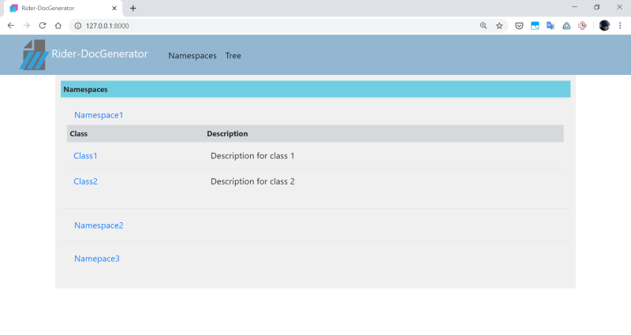
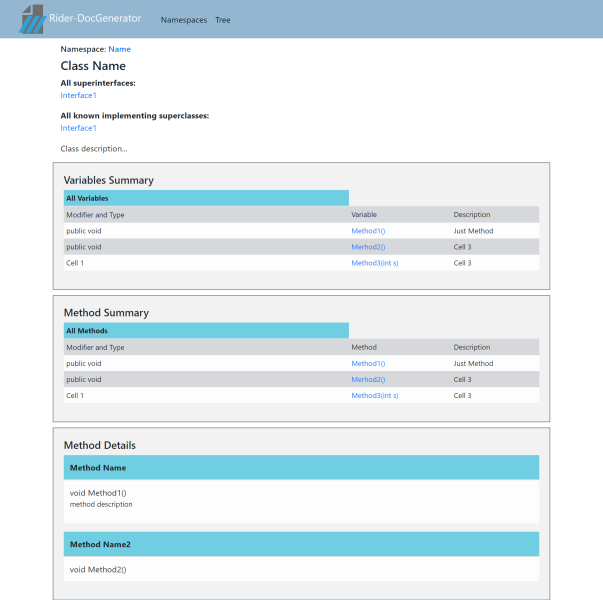
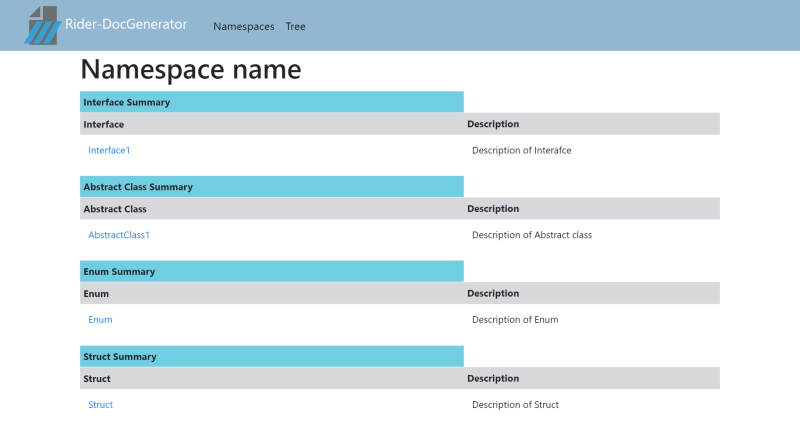

# Rider-DocGenerator 

## Table of contents
* [General info](#general-info)
* [Site design](#interface-design)

## General info
###Rider-DocGenerator — программа, позволяющая получать документацию проектов Rider. В кторой на основе мета-информации об объектах программы, представленных в виде документирующих комментариев формируется готовая документация в виде HTML файла.

## Site design

 